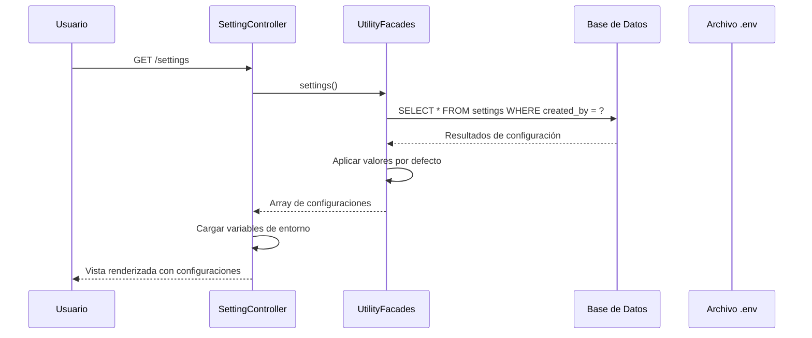
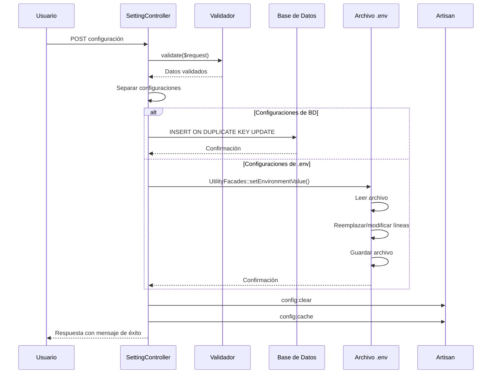
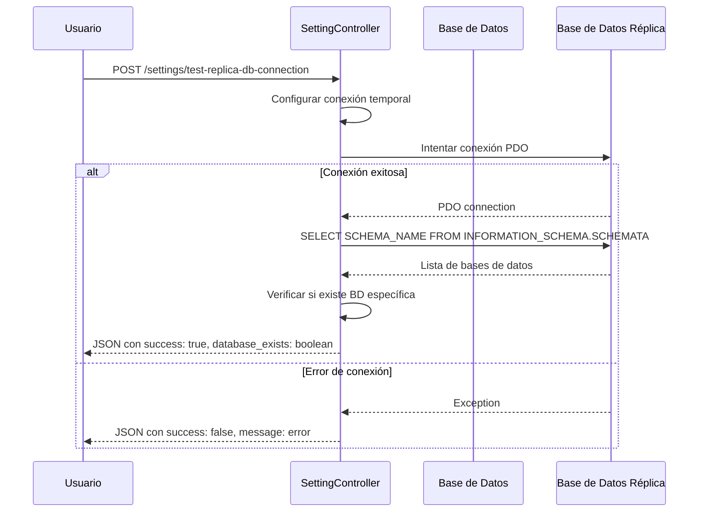
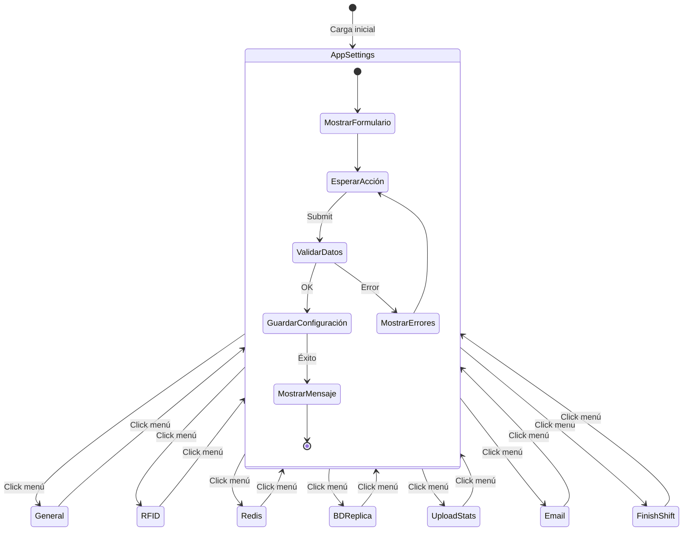
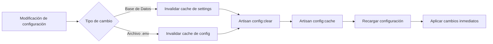
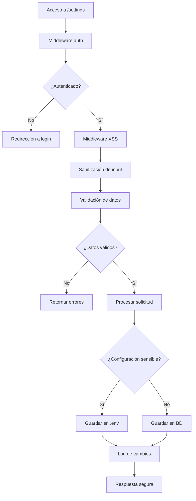

# Diagrama de Flujo del Sistema de Configuración

## Flujo General del Sistema

```mermaid
graph TD
    A[Usuario accede a /settings] --> B{Autenticado?}
    B -->|No| C[Redirección a Login]
    B -->|Sí| D[SettingController@index]
    
    D --> E[Cargar configuraciones]
    E --> F[UtilityFacades::settings]
    F --> G[Consultar tabla settings]
    G --> H[Aplicar valores por defecto]
    H --> I[Renderizar vista settings/setting.blade.php]
    
    I --> J[Mostrar menú lateral]
    J --> K[Usuario selecciona sección]
    
    K --> L{Tipo de configuración}
    L -->|App Settings| M[Formulario de logos y nombre]
    L -->|General| N[Formulario de configuración general]
    L -->|RFID| O[Formulario de configuración RFID]
    L -->|Redis| P[Formulario de configuración Redis]
    L -->|BD Réplica| Q[Formulario de BD réplica]
    L -->|Upload Stats| R[Formulario de Upload Stats]
    L -->|Email| S[Formulario de email]
    L -->|Finish Shift| T[Formulario de emails de turno]
    
    M --> U[Usuario guarda cambios]
    N --> U
    O --> U
    P --> U
    Q --> U
    R --> U
    S --> U
    T --> U
    
    U --> V{Validación}
    V -->|Error| W[Mostrar errores de validación]
    V -->|OK| X[Procesar guardado]
    
    X --> Y{Tipo de almacenamiento}
    Y -->|Base de Datos| Z[DB::insert ON DUPLICATE KEY]
    Y -->|Archivo .env| AA[UtilityFacades::setEnvironmentValue]
    
    Z --> BB[Actualizar tabla settings]
    AA --> CC[Modificar archivo .env]
    
    BB --> DD[Limpiar caché de configuración]
    CC --> DD
    
    DD --> EE[Redirigir con mensaje de éxito]
    W --> FF[Volver al formulario]
```

## Flujo de Carga de Configuración



## Flujo de Guardado de Configuración



## Flujo de Modificación del Archivo .env

```mermaid
flowchart TD
    A[setEnvironmentValue(array)] --> B[Leer archivo .env]
    B --> C[Para cada clave-valor]
    C --> D[Buscar línea existente]
    D --> E{¿Existe la clave?}
    E -->|Sí| F[Reemplazar línea existente]
    E -->|No| G[Agregar nueva línea]
    F --> H[Siguiente clave]
    G --> H
    H --> I{¿Más claves?}
    I -->|Sí| C
    I -->|No| J[Asegurar salto de línea final]
    J --> K[Guardar archivo]
    K --> L{¿Guardado exitoso?}
    L -->|Sí| M[Retornar true]
    L -->|No| N[Retornar false]
```

## Flujo de Prueba de Conexión (BD Réplica)



## Flujo de Navegación en la Interfaz



## Flujo de Gestión de Cache



## Flujo de Seguridad


